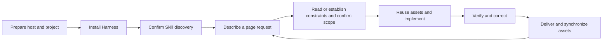

# AI Design Workflow

[中文](README.zh-CN.md)

A Design Harness for consistent, specification-aware page development inside existing coding agents. Its Skills guide the host to establish or read design constraints, reuse components, implement pages and verify applicable visual and business states.

The host owns models, conversation, tools, permissions and sessions. This project provides the design-development foundation. It does not require a standalone agent runtime or GUI.

## Complete usage flow

Users describe requests, confirm proposals and inspect results in their coding agent. The agent reads constraints, implements changes, verifies them and maintains design assets. Per-request manual CLI setup is not required after installation.



### 1. Prepare the host and project

Use an available Codex or Claude Code installation, with your model or account configured in that host. The Harness uses the host's model and tools.

For 0→1 work, prepare an empty target directory. For existing projects, use the actual project root. Obtain this repository and run the installer from its root:

```bash
git clone https://github.com/Tree080730/ai-design-workflow.git
cd ai-design-workflow
```

### 2. Install into the target project

The installer requires Node.js 18+. Installing the example application's dependencies is not a prerequisite.

```bash
node scripts/install-host.mjs /path/to/project --host codex
# For Claude Code:
node scripts/install-host.mjs /path/to/project --host claude
```

Use `--host both` for both integrations or `--dry-run` to preview changes. The same Skills are copied, with a short project instruction entry:

| Host | Skills directory | Instruction entry |
|---|---|---|
| Codex | `.agents/skills/` | Existing `AGENTS.override.md`, otherwise `AGENTS.md` |
| Claude Code | `.claude/skills/` | Existing root `CLAUDE.md`, otherwise existing `.claude/CLAUDE.md`, otherwise a new root `CLAUDE.md` |

Existing instructions are preserved; conflicting or locally modified managed content stops installation. Installation does not initialize product tokens or migrate existing toolchains.

### 3. Confirm discovery in the host

Open the **target project** and start a new session. For first use, ask:

> Locate the available designer-dev-workflow Skill and identify the project constraints you would use for page development. Do not modify files yet.

Confirm that the agent actually located the Skill file. If discovery fails, explicitly invoke `$designer-dev-workflow` in Codex or `/designer-dev-workflow` in Claude Code, then check working directory, loading paths and host configuration. See [Host integration](docs/host-integration.md) for troubleshooting and updates.

### 4. Describe the request through conversation

Provide the page's purpose, content, business behavior and acceptance requirements, plus existing designs, screenshots or specifications when available. You do not need to select every supporting Skill manually.

Example for a new project:

> Use the Design Harness to implement a user-management page with a list, filters and editing. Use my design references to establish minimum constraints and an implementation proposal first. After confirmation, implement it and verify applicable states plus desktop and narrow layouts.

Example for an existing project:

> Use the Design Harness to add a settings page. Read relevant design rules and components, reuse existing layout, form and feedback patterns, explain necessary extensions, then implement and verify through the existing workflow.

### 5. Establish context and confirm the proposal

The agent selects a path from actual project state:

| Scenario | Agent responsibility |
|---|---|
| 0→1 | Confirm platform and technology, establish the application skeleton, minimum tokens/layout/interaction rules, and component/page registration |
| Existing project | Read relevant code and specifications, verify project indexes, identify reuse and necessary extensions, and retain the existing token pipeline |

Use `design-system-builder` when constraints are missing. Use `proposal-with-preview` only when design input is unclear and multiple reasonable implementations exist: summarize directions, expand the selected one, then preview it. Clear references and small changes can skip proposal previews.

The main workflow creates a specification covering scope, reuse, risks and acceptance conditions. The user confirms it in conversation before implementation. Unresolved choices remain explicit; starter values are not confirmed product rules.

### 6. Implement, verify and correct

The agent uses host tools to develop the page, reuses tokens/components/page patterns, and covers applicable loading, empty, error, disabled and boundary states. High-impact changes beyond confirmed scope return to proposal confirmation.

Run existing project builds/checks and verify actual pages, interactions and shared impact. Inspect alignment, overflow, wrapping and responsive reordering at representative desktop and narrow widths. Routing, async, persistence and reversal changes also need applicable success, failure recovery, refresh, reversal and final-state verification. Correct failures and rerun relevant checks.

Static styling changes do not automatically require E2E. Record unavailable or unexecuted verification explicitly; successful builds or zero CLI issues do not replace page verification.

### 7. Deliver and continue iterating

Deliver changes, decisions, verification results and remaining risks. Synchronize affected design rules, component/page indexes and necessary project mappings. The user inspects the page and continues through conversation.

For example:

> Add a role-management page next. Reuse the user-management list, filter and feedback components, preserve the design constraints, and verify effects on the original page when shared components change.

This loop makes initial assets the foundation for later development. A fresh session rereads relevant project constraints and implementation. Task evidence resumption applies only when the project has deliberately adopted task tracking.

### What is optional?

Installation and host discovery establish the integration. CLI scan/init/check/doctor are helpers the agent can use when useful. Managed token export, explicit asset manifests and persisted task evidence are opt-in enhancements. Users do not need a new task plan, token conversion or manual tool invocation for every request. Commands are listed below.

## Core Skills

| Skill | Responsibility |
|---|---|
| `designer-dev-workflow` | Project understanding, change routing, specification, implementation, verification and delivery |
| `design-system-builder` | Executable design constraints, tokens, layouts, states and reusable assets |
| `proposal-with-preview` | Resolve ambiguous page/component implementation choices through progressive previews |
| `rules-governance` | Requested consistency audits and rule-drift review |

For 0→1 projects, establish minimum usable constraints and assets. For existing projects, adopt real code and established rules. Maintain those assets as pages and shared components evolve. Creative ideation is not the core product responsibility.

High-risk flows need relevant success, recovery, persistence, reversal and boundary verification. Reuse existing project tests and the host's browser capabilities. Static styling changes do not automatically require E2E.

## Design System Gallery

Design-system construction includes a persistent Gallery of real tokens, shared component variants/states and page patterns, with source/spec references. The host reuses an existing Storybook/docs site or creates a development entry using the project framework. Gallery imports real assets and remains after temporary proposal previews are removed.

Ask the host to build a Gallery using existing tokens/components, register relevant states and patterns, and verify desktop, narrow-screen and keyboard behavior. See the [implementation contract and React starter](skills/design-system-builder/references/gallery.md). Run the example:

```bash
cd examples/react-vite
npm ci
npm run dev
```

Open the URL printed by Vite. Example assets are candidate; a Gallery or successful build does not certify all business pages.

## Optional engineering helpers

The CLI reduces repeated deterministic work; it is not a prerequisite for the Skills.

| Command | Purpose |
|---|---|
| `scan` | Read-only project facts and discovered paths |
| `init` | Missing starter assets and refreshed Adapter |
| `check` | Static design consistency candidates and configured mappings |
| `doctor` | Structural diagnostics and known constraint-input gaps |
| `tokens` | Opt-in JSON-to-CSS export |
| `task` | Opt-in verification evidence and recovery |

Run from source, for example:

```bash
node packages/cli/bin/design-workflow.mjs scan /path/to/project --json
```

Initialization preserves existing managed starter files unless `--force` is explicit. The Project Adapter is a cache; source and executable configuration remain authoritative. Static-check success and structural health do not certify page quality.

- [Configuration](docs/configuration.md)
- [Token integration](docs/token-integration.md)
- [Optional task evidence](docs/task-evidence.md)

## Status and development

The released baseline is v0.1.2; unreleased host installation and optional tooling changes are listed in [CHANGELOG](CHANGELOG.md). Host integration tests validate files and portable resources, not real model-session behavior or universal compliance.

```bash
npm run validate
```

See [Quick Start](docs/quick-start.md), [Architecture](docs/architecture.md), and [Contributing](CONTRIBUTING.md).

## Repository

```text
skills/                Design-development core
scripts/install-host.mjs  Project-scoped host installer
packages/cli/          Optional deterministic tools and starter assets
examples/react-vite/   Token integration and verification fixture
test/                  Observable behavior tests
docs/                  Product boundaries and usage
```

## License

[MIT](LICENSE)
