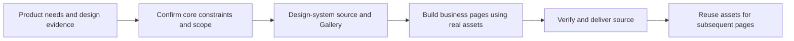

# AI Design Workflow

[中文](README.zh-CN.md)

A Design Harness inside existing coding agents, focused on **0→1 design-system construction and business-page development**. Its Skills turn design evidence into executable constraints, implement design-system source and a Gallery, then reuse real assets to build business pages.

The host owns models, conversation, tools, permissions and sessions. This project provides the design-development foundation. It does not require a standalone agent runtime or GUI.

## Quick start

Have Codex or Claude Code, Node.js 18+ and a target project directory ready. Create an empty directory for a new project, or use the actual root of an existing project. Replace `/path/to/project` below; keep the quotes for paths containing spaces.

```bash
git clone https://github.com/Tree080730/ai-design-workflow.git
cd ai-design-workflow
node scripts/install-host.mjs "/path/to/project" --host codex
```

For Claude Code, replace `codex` with `claude`; use `both` for both hosts. Harness installation needs neither `npm install` nor the example application's dependencies.

Open the **target project** in the host, start a new session and ask:

> Locate the available designer-dev-workflow Skill and identify this project's design constraints for page development. Do not modify files yet.

Once the Skill is located, choose a request below. See [Quick Start](docs/quick-start.md) for details and [Host integration](docs/host-integration.md) for discovery and updates.

## One complete 0→1 request

> Use the Design Harness to build a user-management page from zero, including a list, filters and editing. Read my product requirements and references, confirm the platform, technology and core design constraints, and propose the scope of the design system, Gallery and business page. After I confirm, proceed through that scope: implement real tokens/styles, necessary shared components and a runnable Gallery, then reuse them for the business page and applicable states. Deliver editable source in the target project, runtime entries and commands, specifications/indexes, actual verification results and unfinished items. Do not stop after documentation, placeholder scaffolding or the Gallery alone.

## Four ways to use it

Complete 0→1 construction is the primary path; existing projects, reference extraction and standalone Gallery work are supplementary entry points. Replace the example pages, business requirements and references with your own. The agent reads context and describes a proposal; confirm it in conversation before implementation.

### New project: build from zero

> Use the Design Harness to build a user-management page with a list, filters and editing. Confirm the platform and technology, then establish minimum design constraints from my references. Mark unsupported decisions for confirmation. After I confirm the proposal, implement the page, reusable components and a Gallery, and verify applicable states plus desktop and narrow layouts.

### Existing project: reuse and extend

> Use the Design Harness to add a settings page. Read the actual code, design specifications and components first. Reuse existing layout, form and feedback patterns, preserving the technology stack and token pipeline. Explain necessary extensions, implement after confirmation, check shared impact, and synchronize specifications and the existing Gallery.

### Reference website: extract design rules

> Use design-system-builder to derive colors, typography, spacing, radius, layout and observable component rules from [reference URL] and my screenshots for this project. Distinguish measured values from inferences and record sources. Mark unseen states and breakpoints for confirmation. Let me confirm the core constraints before integrating them into real project styles, components and the Gallery.

Website inspection depends on the host's browser tools and page accessibility. If access fails, use screenshots, structured design data or source code. A URL or screenshot alone does not reveal a website's complete internal design system.

### Design System Gallery: display and maintain

> Use design-system-builder to build a Design System Gallery for this project. Reuse an existing Storybook/docs site or create a project development entry. Import real tokens and components, show applicable variants, states and page patterns, register source/spec references, and provide startup commands, the URL and verification results.

For an existing Gallery, ask: “Add the new component and its states to the Gallery using the real implementation; update specifications and indexes.” See [Design System Gallery](#design-system-gallery) below for the runnable example and integration contract.

## Default 0→1 workflow

Deliver design-system source, a runnable Gallery and business-page source. Users describe requirements, confirm scope and inspect results in the host; the agent implements, verifies and maintains project assets.



| Stage | Input | Output and completion conditions |
|---|---|---|
| 1: Confirm evidence and constraints | Product needs, user flows, platform and references | Source-grounded core tokens/layout/interaction rules, implementation proposal and confirmed scope; unknowns remain explicit |
| 2: Build the design system | Confirmed constraints and assets needed by initial pages | Real styles and necessary component source, a runnable integrated Gallery, matching specifications and indexes; required even on the minimum path |
| 3: Build business pages and deliver | Real design assets and confirmed business scope | Page/route and applicable state/interaction source, Gallery patterns, runtime instructions and actual verification results |

A complete request cannot end after documentation, scaffolding or the Gallery alone. Design-system-only requests stop after the first two stages; do not invent business pages. Add components and patterns needed by current pages instead of building a speculative universal library.

Use clear references directly. Proposal previews apply only when visual direction is unresolved and multiple reasonable implementations exist. Continue within confirmed scope without repeating the same approval at every stage; confirm high-impact scope changes. Starter values are not confirmed product rules.

Delivery lists actual project source, entries/consumers, install/start commands, results, missing implementation and unverified behavior. Remove temporary proposal previews; retain the Gallery and formal pages. Subsequent pages reuse these assets, and fresh sessions reread project constraints and code.

Existing-project support remains a supplementary path that preserves the existing stack and assets. CLI, token export, manifests and task evidence are optional; per-request manual setup is not required.

## Required delivery: implementation source

Page, component and design-system construction must deliver editable source in the target project. Within confirmed scope, include page/component implementation, runtime styles/token integration, Gallery code and necessary entries, dependencies and configuration. This also applies to minimum 0→1 startup; existing projects reuse actual implementations.

Report source paths, runtime entries/consumers, install/start commands and actual verification. Documentation, screenshots, token JSON, indexes and temporary previews alone are not implementation. Missing required source or disconnected entries mean incomplete; execution unavailable in the current environment remains explicitly unverified.

## Core Skills

| Skill | Responsibility |
|---|---|
| `designer-dev-workflow` | Coordinate the 0→1 stages: constraints, design system, business pages and source delivery |
| `design-system-builder` | Executable design constraints, tokens, layouts, states and reusable assets |
| `proposal-with-preview` | Resolve ambiguous page/component implementation choices through progressive previews |
| `rules-governance` | Requested consistency audits and rule-drift review |

For 0→1 projects, establish minimum usable constraints and assets. For existing projects, adopt real code and established rules. Maintain those assets as pages and shared components evolve. Creative ideation is not the core product responsibility.

High-risk flows need relevant success, recovery, persistence, reversal and boundary verification. Reuse existing project tests and the host's browser capabilities. Static styling changes do not automatically require E2E.

## Design System Gallery

The minimum 0→1 path also requires a runnable Gallery: start with real tokens, then add components and patterns as they are implemented. Design-system construction includes a persistent Gallery of real tokens, shared component variants/states and page patterns, with source/spec references. The host reuses an existing Storybook/docs site or creates a development entry using the project framework. Gallery imports real assets and remains after temporary proposal previews are removed.

Ask the host to build a Gallery using existing tokens/components, register relevant states and patterns, and verify desktop, narrow-screen and keyboard behavior. See the [implementation contract and React starter](skills/design-system-builder/references/gallery.md). Run the example:

```bash
cd examples/react-vite
npm ci
npm run dev
```

Open the URL printed by Vite. Example assets are candidate; a Gallery or successful build does not certify all business pages.

## Optional engineering helpers

The CLI reduces repeated deterministic work; it is not a prerequisite for the Skills.

| Command | Purpose |
|---|---|
| `scan` | Read-only project facts and discovered paths |
| `init` | Missing starter assets and refreshed Adapter |
| `check` | Static design consistency candidates and configured mappings |
| `doctor` | Structural diagnostics and known constraint-input gaps |
| `tokens` | Opt-in JSON-to-CSS export |
| `task` | Opt-in verification evidence and recovery |

Run from source, for example:

```bash
node packages/cli/bin/design-workflow.mjs scan /path/to/project --json
```

Initialization preserves existing managed starter files unless `--force` is explicit. The Project Adapter is a cache; source and executable configuration remain authoritative. Static-check success and structural health do not certify page quality.

- [Configuration](docs/configuration.md)
- [Token integration](docs/token-integration.md)
- [Optional task evidence](docs/task-evidence.md)

## Status and development

The released baseline is v0.1.2; unreleased host installation and optional tooling changes are listed in [CHANGELOG](CHANGELOG.md). Host integration tests validate files and portable resources, not real model-session behavior or universal compliance.

```bash
npm run validate
```

See [Quick Start](docs/quick-start.md), [Architecture](docs/architecture.md), and [Contributing](CONTRIBUTING.md).

## Repository

```text
skills/                Design-development core
scripts/install-host.mjs  Project-scoped host installer
packages/cli/          Optional deterministic tools and starter assets
examples/react-vite/   Token integration and verification fixture
test/                  Observable behavior tests
docs/                  Product boundaries and usage
```

## License

[MIT](LICENSE)
