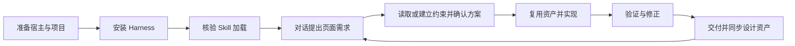

# AI Design Workflow

[English](README.md)

一套运行在成熟 coding Agent 中的 **Design Harness**。通过 Skills 帮助 Agent 建立或读取设计约束、复用组件、实现规范页面，并验证适用的视觉和业务状态。

宿主负责模型、对话、工具、权限和会话，本项目负责设计开发底座。当前不建设独立 Agent 框架或 GUI。

## 完整使用流程

用户在宿主中对话提出需求、确认方案并查看结果；Agent 负责读取约束、执行开发、验证和维护设计资产。安装完成后，每次需求不需要手动重复执行 CLI。



### 1. 准备宿主与项目

先准备可用的 Codex 或 Claude Code，并在宿主中配置自己的模型或账号。Harness 沿用宿主提供的模型和工具。

准备目标项目目录：0→1 可以是空目录，已有项目使用实际项目根目录。获取本仓库后，在仓库根目录执行安装命令：

```bash
git clone https://github.com/Tree080730/ai-design-workflow.git
cd ai-design-workflow
```

### 2. 安装到目标项目

安装脚本需要 Node.js 18+；无需先安装示例项目依赖。

```bash
node scripts/install-host.mjs /你的项目路径 --host codex
# 使用 Claude Code 时：
node scripts/install-host.mjs /你的项目路径 --host claude
```

两种宿主都使用时可选 `--host both`；`--dry-run` 只预览变化。安装复制同一套 Skills，并向项目宿主指令文件添加简短入口：

| 宿主 | Skills 目录 | 指令入口 |
|---|---|---|
| Codex | `.agents/skills/` | 已有 `AGENTS.override.md`，否则 `AGENTS.md` |
| Claude Code | `.claude/skills/` | 已有根目录 `CLAUDE.md`，否则已有 `.claude/CLAUDE.md`，否则新建根目录 `CLAUDE.md` |

安装保留原有项目指令，遇到冲突或本地修改的受管理内容时停止。它不会初始化产品 tokens，也不会要求已有项目迁移工具链。

### 3. 在宿主中核验加载

打开**目标项目**，启动新会话。首次使用可以先发送：

> 请定位当前可用的 designer-dev-workflow Skill，说明接下来开发页面会读取哪些项目约束。先不要修改文件。

确认 Agent 实际找到了 Skill 文件。未发现时可显式调用 Codex 的 `$designer-dev-workflow` 或 Claude Code 的 `/designer-dev-workflow`，再核验工作目录、加载路径和宿主配置。详细排查与更新方式见 [宿主接入说明](docs/host-integration.md)。

### 4. 通过对话提出需求

描述页面用途、内容、业务行为和验收要求；有现成设计稿、截图或规范时一并提供。无需手动选择每个子 Skill。

0→1 请求示例：

> 使用 Design Harness，为这个新项目实现用户管理页面，包含列表、筛选和编辑。参考我提供的设计依据，先形成最小设计约束与实现方案；确认后开发，并验证适用的状态和桌面、窄屏布局。

已有项目请求示例：

> 使用 Design Harness，在现有项目中新增设置页面。先读取相关设计规范和组件，复用已有布局、表单与反馈模式，说明需要扩展的部分，并按现有流程实现和验证。

### 5. 建立上下文并确认方案

Agent 根据项目实际状态选择路径：

| 场景 | Agent 的工作 |
|---|---|
| 0→1 | 确认平台和技术方案，建立业务骨架、最小 tokens、布局/交互约束，以及组件和页面登记方式 |
| 已有项目 | 读取相关实现和规范，核验项目索引，识别可复用资产与必要扩展，保留已有 token 工具链 |

约束不足时按需使用 `design-system-builder`。没有明确设计输入且存在多种合理实现时，才使用 `proposal-with-preview` 确认方向：先摘要、再展开被选方案、再预览。明确设计输入或小范围修改可以跳过预览提案。

主流程形成 Spec，说明范围、复用判断、风险与验收条件，用户在对话中确认后进入实现。待确认内容应明确记录；模板默认值不作为已确认的产品规范。

### 6. 实现、验证与修正

Agent 使用宿主工具完成开发，优先复用已有 tokens、组件和页面模式，补齐适用的加载、空、错误、禁用和边界状态。超出已确认范围的高影响变化需要回到方案确认。

随后运行项目已有构建与检查，并验证实际页面、交互和共享影响。视觉检查覆盖代表性桌面与窄屏的对齐、溢出、文字换行及响应式重排；路由、异步、持久化或可逆操作还需验证适用的成功、失败恢复、刷新、撤销和最终状态。发现问题先修正，再重验相关部分。

普通静态样式修改不默认要求 E2E。没有可运行的验证能力时明确记录未验证项；构建通过或 CLI 零问题不能替代页面验证。

### 7. 交付并继续迭代

Agent 交付变更、关键决策、验证结果和未验证风险，并同步受影响的设计规范、组件/页面索引与必要的项目映射。用户查看页面与结果，继续在对话中提出下一项需求。

例如：

> 继续新增角色管理页面，复用用户管理页面的列表、筛选和反馈组件，保持已有设计约束，并检查共享组件改动对原页面的影响。

这条循环让首批页面的资产成为后续开发基础。新会话中重新读取项目约束与相关实现；只有项目主动采用 task 追踪时，才通过它恢复任务证据。

### 哪些操作是可选的？

安装和宿主加载是接入步骤；CLI 扫描、初始化、检查与诊断由 Agent 按需使用。托管 token 导出、显式资产清单和 task 证据追踪都是可选增强，不要求用户每次创建任务计划、转换 token 格式或手动运行工具。具体命令见下方。

## 核心能力

| Skill | 职责 |
|---|---|
| `designer-dev-workflow` | 项目理解、需求分诊、方案、实现、验证与交付 |
| `design-system-builder` | 设计约束、tokens、布局、状态和可复用资产 |
| `proposal-with-preview` | 通过渐进预览确认有分歧的页面或组件实现方案 |
| `rules-governance` | 按需巡检一致性与规则漂移 |

0→1 建立必要的最小约束与资产；已有项目沿用真实源码和现有规范。随着页面、共享组件与业务流程迭代持续维护这些资产。创意生成不属于核心职责。

高风险流程验证适用的成功、恢复、刷新、撤销和边界状态，优先使用项目已有测试和宿主浏览器能力。普通静态样式修改不默认要求 E2E。

## 可选工程工具

CLI 用于减少重复的确定性操作，不是使用 Skills 的前置条件。

| 命令 | 用途 |
|---|---|
| `scan` | 只读扫描项目事实与目录 |
| `init` | 创建缺失模板并刷新 Adapter |
| `check` | 静态一致性候选问题与已配置映射检查 |
| `doctor` | 结构诊断与已知约束缺口 |
| `tokens` | 按需从 JSON 导出 CSS |
| `task` | 按需记录验证证据和恢复任务 |

源码运行示例：

```bash
node packages/cli/bin/design-workflow.mjs scan /你的项目路径 --json
```

初始化默认保留已有受管理模板，只有显式 `--force` 才允许替换。Adapter 是索引和缓存，源码与可执行配置是事实来源。静态检查或结构健康不代表页面质量已经通过验证。

- [配置与诊断](docs/configuration.md)
- [Token 接入与资产映射](docs/token-integration.md)
- [可选任务证据追踪](docs/task-evidence.md)

## 当前状态与开发

已发布基线为 v0.1.2，当前未发布的宿主接入和工具增强见 [CHANGELOG](CHANGELOG.md)。安装测试验证文件与独立资源可用性，尚未验证真实宿主模型会话或所有环境下的遵循效果。

```bash
npm run validate
```

进一步阅读：[快速上手](docs/quick-start.md)、[架构](docs/architecture.md)、[贡献指南](CONTRIBUTING.md)。

## License

[MIT](LICENSE)
