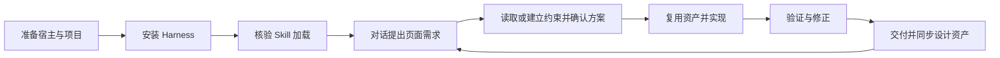

# AI Design Workflow

[English](README.md)

一套运行在成熟 coding Agent 中的 **Design Harness**。通过 Skills 帮助 Agent 建立或读取设计约束、复用组件、实现规范页面，并验证适用的视觉和业务状态。

宿主负责模型、对话、工具、权限和会话，本项目负责设计开发底座。当前不建设独立 Agent 框架或 GUI。

## 快速开始

准备好 Codex 或 Claude Code、Node.js 18+ 和目标项目目录。新项目先创建空目录；已有项目直接使用项目根目录。将下面的 `/你的项目路径` 替换为实际路径，保留引号以支持含空格的目录。

```bash
git clone https://github.com/Tree080730/ai-design-workflow.git
cd ai-design-workflow
node scripts/install-host.mjs "/你的项目路径" --host codex
```

Claude Code 将 `codex` 换成 `claude`；同时接入两者用 `both`。安装 Harness 无需运行 `npm install`，也无需安装示例项目依赖。

然后在宿主中打开**目标项目**，启动新会话，发送：

> 请定位当前可用的 designer-dev-workflow Skill，说明本项目开发页面会读取哪些设计约束。先不要修改文件。

确认找到 Skill 后，从下面四种场景中选择一个需求。详细说明见[中文快速上手](docs/quick-start.zh-CN.md)，加载与更新问题见[宿主接入说明](docs/host-integration.md)。

## 四种使用场景

将示例中的页面、业务和参考资料替换为你的实际需求。Agent 先读取上下文并说明方案，你在对话中确认后进入实现。

### 新项目：从 0 到 1

> 使用 Design Harness，为这个新项目实现用户管理页面，包含列表、筛选和编辑。先确认平台与技术方案，结合我提供的参考建立最小设计约束；没有依据的内容标记待确认。确认方案后实现页面、沉淀可复用组件和 Gallery，并验证适用的状态与桌面、窄屏布局。

### 已有项目：复用并扩展

> 使用 Design Harness，为当前项目新增设置页面。先读取现有源码、设计规范和组件，复用已有布局、表单与反馈模式，保留当前技术栈和 token 工具链。说明必要扩展，确认后实现、检查共享影响，并同步规范和已有 Gallery。

### 参考网页：提取设计系统

> 使用 design-system-builder，以［参考网页 URL］及我提供的截图为依据，为当前项目提取颜色、字体、间距、圆角、布局及可观察的组件规则。区分实测值与推断，记录来源；未观察到的状态和断点标记待确认。先让我确认核心约束，再将其落到项目真实样式、组件和 Gallery 中。

网页读取依赖宿主浏览器能力与页面可访问性；无法访问时改用截图、结构化设计数据或源码。该流程用于提炼可复用规则，单个 URL 或截图不等于获取了网站完整的内部设计系统。

### Design System Gallery：展示与维护

> 使用 design-system-builder，为当前项目建立 Design System Gallery。优先复用已有 Storybook 或文档站，否则建立项目开发入口。引用真实 tokens 和组件，展示适用的变体、状态与页面模式，登记源码和规范位置，并提供启动命令、访问地址与验证结果。

已有 Gallery 时可以继续说：“将刚新增的组件及其状态同步到 Gallery，复用真实实现，并更新规范与索引。”运行示例与接入规则见下方 [Design System Gallery](#design-system-gallery)。

## 完整使用流程

用户在宿主中对话提出需求、确认方案并查看结果；Agent 负责读取约束、执行开发、验证和维护设计资产。安装完成后，每次需求不需要手动重复执行 CLI。



### 1. 准备宿主与项目

先准备可用的 Codex 或 Claude Code，并在宿主中配置自己的模型或账号。Harness 沿用宿主提供的模型和工具。

准备目标项目目录：0→1 可以是空目录，已有项目使用实际项目根目录。仓库获取与安装命令见上方快速开始。

### 2. 安装到目标项目

安装脚本需要 Node.js 18+；无需先安装示例项目依赖。

```bash
node scripts/install-host.mjs "/你的项目路径" --host codex
# 使用 Claude Code 时：
node scripts/install-host.mjs "/你的项目路径" --host claude
```

两种宿主都使用时可选 `--host both`；`--dry-run` 只预览变化。安装复制同一套 Skills，并向项目宿主指令文件添加简短入口：

| 宿主 | Skills 目录 | 指令入口 |
|---|---|---|
| Codex | `.agents/skills/` | 已有 `AGENTS.override.md`，否则 `AGENTS.md` |
| Claude Code | `.claude/skills/` | 已有根目录 `CLAUDE.md`，否则已有 `.claude/CLAUDE.md`，否则新建根目录 `CLAUDE.md` |

安装保留原有项目指令，遇到冲突或本地修改的受管理内容时停止。它不会初始化产品 tokens，也不会要求已有项目迁移工具链。

### 3. 在宿主中核验加载

打开**目标项目**，启动新会话。首次使用可以先发送：

> 请定位当前可用的 designer-dev-workflow Skill，说明接下来开发页面会读取哪些项目约束。先不要修改文件。

确认 Agent 实际找到了 Skill 文件。未发现时可显式调用 Codex 的 `$designer-dev-workflow` 或 Claude Code 的 `/designer-dev-workflow`，再核验工作目录、加载路径和宿主配置。详细排查与更新方式见 [宿主接入说明](docs/host-integration.md)。

### 4. 通过对话提出需求

描述页面用途、内容、业务行为和验收要求；有现成设计稿、截图或规范时一并提供。无需手动选择每个子 Skill。

可直接使用上方[四种使用场景](#四种使用场景)中的对话示例；参考网页提取和 Gallery 建设也通过宿主对话执行。

### 5. 建立上下文并确认方案

Agent 根据项目实际状态选择路径：

| 场景 | Agent 的工作 |
|---|---|
| 0→1 | 确认平台和技术方案，建立业务骨架、最小 tokens、布局/交互约束，以及组件和页面登记方式 |
| 已有项目 | 读取相关实现和规范，核验项目索引，识别可复用资产与必要扩展，保留已有 token 工具链 |

约束不足时按需使用 `design-system-builder`。没有明确设计输入且存在多种合理实现时，才使用 `proposal-with-preview` 确认方向：先摘要、再展开被选方案、再预览。明确设计输入或小范围修改可以跳过预览提案。

主流程形成 Spec，说明范围、复用判断、风险与验收条件，用户在对话中确认后进入实现。待确认内容应明确记录；模板默认值不作为已确认的产品规范。

### 6. 实现、验证与修正

Agent 使用宿主工具完成开发，优先复用已有 tokens、组件和页面模式，补齐适用的加载、空、错误、禁用和边界状态。超出已确认范围的高影响变化需要回到方案确认。

随后运行项目已有构建与检查，并验证实际页面、交互和共享影响。视觉检查覆盖代表性桌面与窄屏的对齐、溢出、文字换行及响应式重排；路由、异步、持久化或可逆操作还需验证适用的成功、失败恢复、刷新、撤销和最终状态。发现问题先修正，再重验相关部分。

普通静态样式修改不默认要求 E2E。没有可运行的验证能力时明确记录未验证项；构建通过或 CLI 零问题不能替代页面验证。

### 7. 交付并继续迭代

Agent 交付变更、关键决策、验证结果和未验证风险，并同步受影响的设计规范、组件/页面索引与必要的项目映射。用户查看页面与结果，继续在对话中提出下一项需求。

例如：

> 继续新增角色管理页面，复用用户管理页面的列表、筛选和反馈组件，保持已有设计约束，并检查共享组件改动对原页面的影响。

这条循环让首批页面的资产成为后续开发基础。新会话中重新读取项目约束与相关实现；只有项目主动采用 task 追踪时，才通过它恢复任务证据。

### 哪些操作是可选的？

安装和宿主加载是接入步骤；CLI 扫描、初始化、检查与诊断由 Agent 按需使用。托管 token 导出、显式资产清单和 task 证据追踪都是可选增强，不要求用户每次创建任务计划、转换 token 格式或手动运行工具。具体命令见下方。

## 核心能力

| Skill | 职责 |
|---|---|
| `designer-dev-workflow` | 项目理解、需求分诊、方案、实现、验证与交付 |
| `design-system-builder` | 设计约束、tokens、布局、状态和可复用资产 |
| `proposal-with-preview` | 通过渐进预览确认有分歧的页面或组件实现方案 |
| `rules-governance` | 按需巡检一致性与规则漂移 |

0→1 建立必要的最小约束与资产；已有项目沿用真实源码和现有规范。随着页面、共享组件与业务流程迭代持续维护这些资产。创意生成不属于核心职责。

高风险流程验证适用的成功、恢复、刷新、撤销和边界状态，优先使用项目已有测试和宿主浏览器能力。普通静态样式修改不默认要求 E2E。

## Design System Gallery

设计系统建设包含持续维护的 Gallery：展示真实 tokens、组件变体与状态、页面模式，并登记源码和规范位置。宿主 Agent 优先复用已有 Storybook/文档站；没有时在目标项目中搭建开发入口，沿用现有框架。Gallery 引用真实组件与样式，不复制一套展示专用实现，也不会随临时方案预览清理。

可通过对话请求：

> 为这个项目建立 Design System Gallery，复用已有 tokens 和组件，展示适用的变体、状态与页面模式，登记源码与规范，并验证桌面、窄屏和键盘操作。

[实施契约](skills/design-system-builder/references/gallery.md)提供框架无关的接入与验收规则，以及 React 起步模板。运行仓库示例：

```bash
cd examples/react-vite
npm ci
npm run dev
```

打开 Vite 输出的地址即可查看 Gallery。示例资产为 candidate；Gallery 展示和构建通过不等于所有业务页面已验证。

## 可选工程工具

CLI 用于减少重复的确定性操作，不是使用 Skills 的前置条件。

| 命令 | 用途 |
|---|---|
| `scan` | 只读扫描项目事实与目录 |
| `init` | 创建缺失模板并刷新 Adapter |
| `check` | 静态一致性候选问题与已配置映射检查 |
| `doctor` | 结构诊断与已知约束缺口 |
| `tokens` | 按需从 JSON 导出 CSS |
| `task` | 按需记录验证证据和恢复任务 |

源码运行示例：

```bash
node packages/cli/bin/design-workflow.mjs scan /你的项目路径 --json
```

初始化默认保留已有受管理模板，只有显式 `--force` 才允许替换。Adapter 是索引和缓存，源码与可执行配置是事实来源。静态检查或结构健康不代表页面质量已经通过验证。

- [配置与诊断](docs/configuration.md)
- [Token 接入与资产映射](docs/token-integration.md)
- [可选任务证据追踪](docs/task-evidence.md)

## 当前状态与开发

已发布基线为 v0.1.2，当前未发布的宿主接入和工具增强见 [CHANGELOG](CHANGELOG.md)。安装测试验证文件与独立资源可用性，尚未验证真实宿主模型会话或所有环境下的遵循效果。

```bash
npm run validate
```

进一步阅读：[快速上手](docs/quick-start.zh-CN.md)、[架构](docs/architecture.md)、[贡献指南](CONTRIBUTING.md)。

## License

[MIT](LICENSE)
