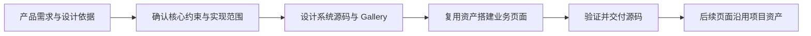

# AI Design Workflow

[English](README.md)

一套运行在成熟 coding Agent 中的 **Design Harness**，优先面向 **0→1 的设计系统构建与业务页面搭建**。通过 Skills 将设计依据转为可执行约束，落地设计系统源码与 Gallery，再复用真实资产实现业务页面。

宿主负责模型、对话、工具、权限和会话，本项目负责设计开发底座。提供本地设计选择 GUI，继续使用宿主的模型与执行能力，不另建 Agent 运行时或模型 API。

## 快速开始

准备好 Codex 或 Claude Code、Node.js 18+ 和目标项目目录。新项目先创建空目录；已有项目直接使用项目根目录。将下面的 `/你的项目路径` 替换为实际路径，保留引号以支持含空格的目录。

```bash
git clone https://github.com/Tree080730/ai-design-workflow.git
cd ai-design-workflow
node scripts/install-host.mjs "/你的项目路径" --host codex
```

Claude Code 将 `codex` 换成 `claude`；同时接入两者用 `both`。安装 Harness 无需运行 `npm install`，也无需安装示例项目依赖。

然后在宿主中打开**目标项目**，启动新会话，发送：

> 请定位当前可用的 designer-dev-workflow Skill，说明本项目开发页面会读取哪些设计约束。先不要修改文件。

确认找到 Skill 后，从下面四种场景中选择一个需求。详细说明见[中文快速上手](docs/quick-start.zh-CN.md)，加载与更新问题见[宿主接入说明](docs/host-integration.md)。

## GUI：选择设计系统基础

在此仓库目录运行（Node.js 18+，无需额外依赖）：

```bash
npm run gui -- --project "/你的项目路径"
```

在宿主浏览器打开 `http://127.0.0.1:4173/`。端口占用时增加 `--port 4174`。

首页呈现 Ant Design、TDesign、Material、Cloudscape、Carbon、Fluent、Spectrum 和 Apple HIG 的 Logo 与名称。点击查看详情，再点击“选择并继续”进入自然语言需求页；可调整仅参考规范或复用组件基础，补充业务需求与自己的风格参考后保存。Apple HIG 仅作为设计参考。

选择保存在目标项目的 `.design-workflow/design-basis.json`。复制界面中的交接指令到宿主会话，由 Skills 读取选择、确认技术兼容性与版本，再实现设计系统源码、Gallery 和业务页面。当前 GUI 不直接触发宿主 Agent；选择基础不代表组件已经安装或页面已经实现。

详见 [GUI 使用说明与预设来源](docs/design-builder.md)。

## 一个完整的 0→1 请求

> 使用 Design Harness，从 0 到 1 搭建用户管理业务页面，包含列表、筛选和编辑。先读取我的产品需求与参考资料，确认平台、技术方案和核心设计约束；说明设计系统、Gallery 与业务页面的实现范围，待我确认后持续执行。先落地真实 tokens/样式、当前需要的共享组件和可运行 Gallery，再复用它们实现业务页面及适用状态。交付目标项目中的可编辑源码、运行入口和命令、规范与索引，以及实际验证结果和未完成项。不要停在只生成文档、占位骨架或 Gallery 的阶段。

## 四种使用场景

以完整 0→1 建设为主；已有项目、参考提取与独立 Gallery 请求作为补充入口。将示例中的页面、业务和参考资料替换为你的实际需求。Agent 先读取上下文并说明方案，你在对话中确认后进入实现。

### 新项目：从 0 到 1

> 使用 Design Harness，为这个新项目实现用户管理页面，包含列表、筛选和编辑。先确认平台与技术方案，结合我提供的参考建立最小设计约束；没有依据的内容标记待确认。确认方案后实现页面、沉淀可复用组件和 Gallery，并验证适用的状态与桌面、窄屏布局。

### 已有项目：复用并扩展

> 使用 Design Harness，为当前项目新增设置页面。先读取现有源码、设计规范和组件，复用已有布局、表单与反馈模式，保留当前技术栈和 token 工具链。说明必要扩展，确认后实现、检查共享影响，并同步规范和已有 Gallery。

### 参考网页：提取设计系统

> 使用 design-system-builder，以［参考网页 URL］及我提供的截图为依据，为当前项目提取颜色、字体、间距、圆角、布局及可观察的组件规则。区分实测值与推断，记录来源；未观察到的状态和断点标记待确认。先让我确认核心约束，再将其落到项目真实样式、组件和 Gallery 中。

网页读取依赖宿主浏览器能力与页面可访问性；无法访问时改用截图、结构化设计数据或源码。该流程用于提炼可复用规则，单个 URL 或截图不等于获取了网站完整的内部设计系统。

### Design System Gallery：展示与维护

> 使用 design-system-builder，为当前项目建立 Design System Gallery。优先复用已有 Storybook 或文档站，否则建立项目开发入口。引用真实 tokens 和组件，展示适用的变体、状态与页面模式，登记源码和规范位置，并提供启动命令、访问地址与验证结果。

已有 Gallery 时可以继续说：“将刚新增的组件及其状态同步到 Gallery，复用真实实现，并更新规范与索引。”运行示例与接入规则见下方 [Design System Gallery](#design-system-gallery)。

## 0→1 主流程

默认交付设计系统源码、可运行 Gallery 和业务页面源码。用户在宿主里描述需求、确认范围并查看结果；Agent 负责实现、验证和同步项目资产。



| 阶段 | 输入 | 产出与完成条件 |
|---|---|---|
| 一：确认设计依据与约束 | 产品需求、业务链路、平台与参考资料 | 有来源的核心 tokens/布局/交互约束、实现方案及确认范围；未知项明确记录 |
| 二：构建设计系统 | 已确认约束与首批页面所需资产 | 真实样式与必要组件源码、接入工程的可运行 Gallery、对应规范与索引；最小路径同样必需 |
| 三：搭建业务页面并交付 | 设计系统真实资产和业务范围 | 页面/路由及适用状态、交互源码，Gallery 页面模式、运行方式和实际验证结果 |

完整需求不能在文档、工程骨架或 Gallery 产出后提前结束。用户只要求设计系统时完成前两阶段，不额外生成业务页面；当前页面需要的新组件和模式按需补充，不先搭建庞大的通用组件库。

已有明确参考时直接提炼约束；视觉方向有分歧且存在多种合理解法时才用方案预览。确认实现范围后持续推进，不在每一阶段重复索取同一授权；高影响范围变化再确认。模板默认值不能当作已确认产品规则。

交付必须给出目标项目源码位置、入口与引用、安装/启动命令、实际验证结果与未实现/未验证项。临时方案预览清理，长期 Gallery 与正式页面保留。下一页继续复用已有资产，新会话重新读取项目约束与实现。

已有项目支持作为补充路径保留，沿用现有技术栈和资产。0→1 默认由 Agent 生成交付契约并调用随 Skill 安装的检查器，用户不需要每次手动初始化工具。独立 CLI、token 导出和 task 管理仍按需使用。

## 必需交付：真实源码

页面、组件和设计系统建设必须交付目标项目中可编辑的实现源码：按确认范围包含页面与组件、真实样式/token 接入、Gallery 代码以及必要入口、依赖和工程配置。最小 0→1 路径同样适用，已有项目优先复用现有实现。

交付列出实际源码路径、入口与引用关系、安装/启动命令及验证结果。文档、截图、token JSON、索引或临时预览不能替代实现；必需源码缺失或入口未接通属于未完成，环境无法执行时明确为运行未验证。

## 默认交付检查

0→1 不再只靠 Skill 文字判断完成。Agent 将已确认范围写入 `.design-workflow/delivery.json`，登记规则、真实源码与入口、Gallery/页面地址及必需验收。检查器复用现有证据引擎；源码、规则或附件改变后，旧验证不再有效。

从安装后的目标项目运行：

```bash
node .agents/skills/designer-dev-workflow/scripts/verify-project.mjs status .
```

Claude Code 将 `.agents` 换成 `.claude`。返回 JSON 的阶段状态、阻塞项与 `canFinish`；必需内容或验证未完成时退出 2，已登记验收全部通过时退出 0。Agent 根据阻塞项修正并复查。用户只要求设计系统时不强制业务页面，Gallery 仍然必需。

将同一命令接入项目 CI，才能由流水线阻止不合格交付。Skill 不能强制任意宿主执行；视觉/业务观察仍需真实证据，程序通过不等于所有设计判断正确。具体契约、命令、CI 证据来源和边界见[交付检查说明](docs/delivery-contract.md)。

## 核心能力

| Skill | 职责 |
|---|---|
| `designer-dev-workflow` | 编排 0→1 三阶段：约束确认、设计系统、业务页面与源码交付 |
| `design-system-builder` | 将约束落为真实 tokens/样式、必要组件源码与 Gallery |
| `proposal-with-preview` | 通过渐进预览确认有分歧的页面或组件实现方案 |
| `rules-governance` | 按需巡检一致性与规则漂移 |

0→1 建立必要的最小约束与资产；已有项目沿用真实源码和现有规范。随着页面、共享组件与业务流程迭代持续维护这些资产。创意生成不属于核心职责。

高风险流程验证适用的成功、恢复、刷新、撤销和边界状态，优先使用项目已有测试和宿主浏览器能力。普通静态样式修改不默认要求 E2E。

## Design System Gallery

0→1 的最小启动路径也必须交付可运行的 Gallery，先展示真实 tokens，再随实现补齐组件与页面模式。设计系统建设包含持续维护的 Gallery：展示真实 tokens、组件变体与状态、页面模式，并登记源码和规范位置。宿主 Agent 优先复用已有 Storybook/文档站；没有时在目标项目中搭建开发入口，沿用现有框架。Gallery 引用真实组件与样式，不复制一套展示专用实现，也不会随临时方案预览清理。

可通过对话请求：

> 为这个项目建立 Design System Gallery，复用已有 tokens 和组件，展示适用的变体、状态与页面模式，登记源码与规范，并验证桌面、窄屏和键盘操作。

[实施契约](skills/design-system-builder/references/gallery.md)提供框架无关的接入与验收规则，以及 React 起步模板。运行仓库示例：

```bash
cd examples/react-vite
npm ci
npm run dev
```

打开 Vite 输出的地址即可查看 Gallery。示例资产为 candidate；Gallery 展示和构建通过不等于所有业务页面已验证。

## 可选工程工具

CLI 用于减少重复的确定性操作，不是使用 Skills 的前置条件。

| 命令 | 用途 |
|---|---|
| `scan` | 只读扫描项目事实与目录 |
| `init` | 创建缺失模板并刷新 Adapter |
| `check` | 静态一致性候选问题与已配置映射检查 |
| `doctor` | 结构诊断与已知约束缺口 |
| `tokens` | 按需从 JSON 导出 CSS |
| `task` | 按需记录验证证据和恢复任务 |
| `delivery` | 与随 Skill 安装的默认交付检查器等价 |

源码运行示例：

```bash
node packages/cli/bin/design-workflow.mjs scan /你的项目路径 --json
```

初始化默认保留已有受管理模板，只有显式 `--force` 才允许替换。Adapter 是索引和缓存，源码与可执行配置是事实来源。静态检查或结构健康不代表页面质量已经通过验证。

- [配置与诊断](docs/configuration.md)
- [Token 接入与资产映射](docs/token-integration.md)
- [可选任务证据追踪](docs/task-evidence.md)

## 当前状态与开发

已发布基线为 v0.1.2，当前未发布的宿主接入和工具增强见 [CHANGELOG](CHANGELOG.md)。安装测试验证文件与独立资源可用性，尚未验证真实宿主模型会话或所有环境下的遵循效果。

```bash
npm run validate
```

进一步阅读：[快速上手](docs/quick-start.zh-CN.md)、[架构](docs/architecture.md)、[贡献指南](CONTRIBUTING.md)。

## License

[MIT](LICENSE)
